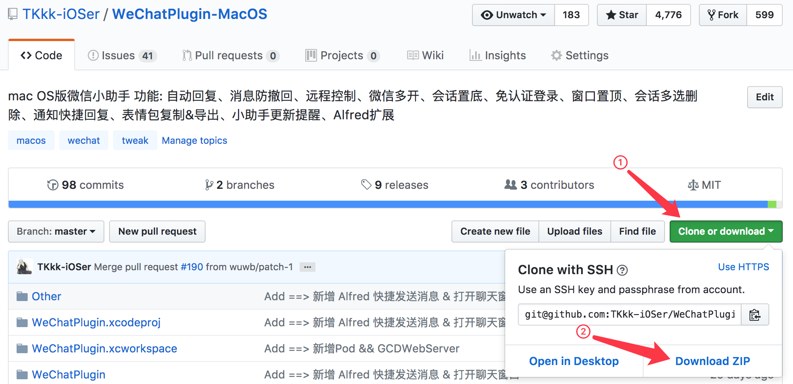
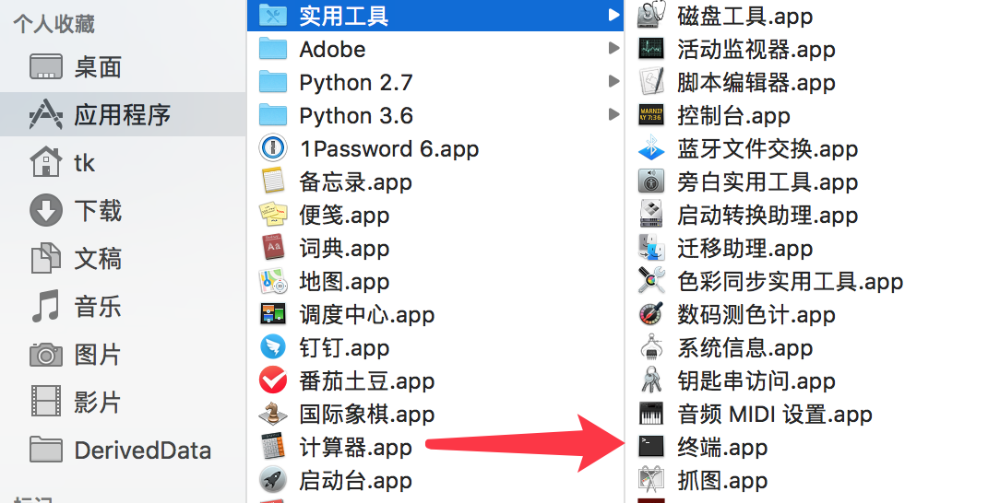
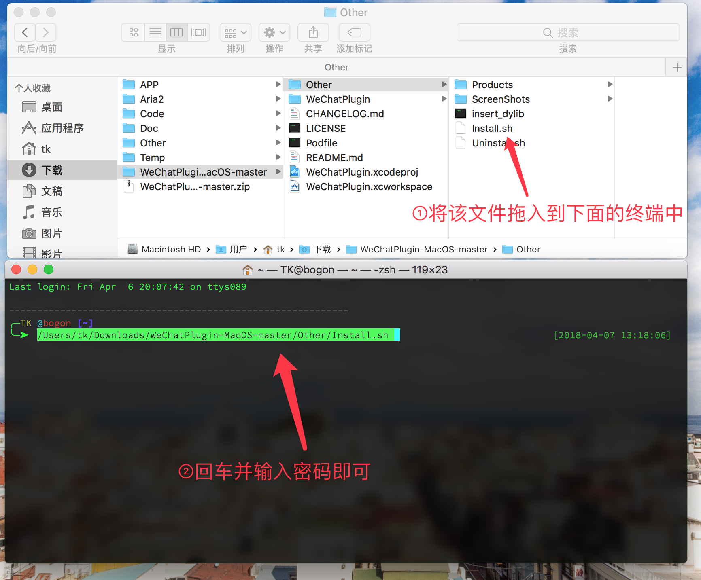

## Install

**第一次安装需要输入密码，仅是为了获取写入微信文件夹的权限**

**0. 懒癌版安装&升级(需要git支持)**

打开`应用程序-实用工具-Terminal(终端)`，执行以下命令并根据提示输入密码即可。

`cd ~/Downloads && rm -rf WeChatPlugin-MacOS && git clone https://github.com/TKkk-iOSer/WeChatPlugin-MacOS.git --depth=1 && ./WeChatPlugin-MacOS/Other/Install.sh`

**1. 普通安装**

* 点击`clone or download`按钮下载 WeChatPlugin 并解压

* 从`应用程序-实用工具`中打开Terminal(终端)

* 拖动解压后`Install.sh` 文件到终端中回车即可.

**2. 若想修改源码&重编译(需要安装Cocoapods)**

* 先更改微信的 owner 以获取写入微信文件夹的权限，否则会出现类似**Permission denied**的错误。 

`sudo chown -R $(whoami) /Applications/WeChat.app` 

* 下载 WeChatPlugin, 进行`Pod install`。
* 用Xcode打开，编辑 Scheme，在 Debug 模式下启动 WeChat。

* 之后 Run (`command + R`)即可启动微信，此时插件注入完成。
 
* 若 Error，提示找不到 Framework，先进行 Build。
* 若Error, 需要配置环境，请参考[我的博客](http://www.tkkk.fun/2017/04/21/macOS%E9%80%86%E5%90%91-%E5%BE%AE%E4%BF%A1%E5%B0%8F%E5%8A%A9%E6%89%8B/)。

## 卸载

打开Terminal(终端)，拖动解压后`Uninstall.sh` 文件到 Terminal 回车即可。

