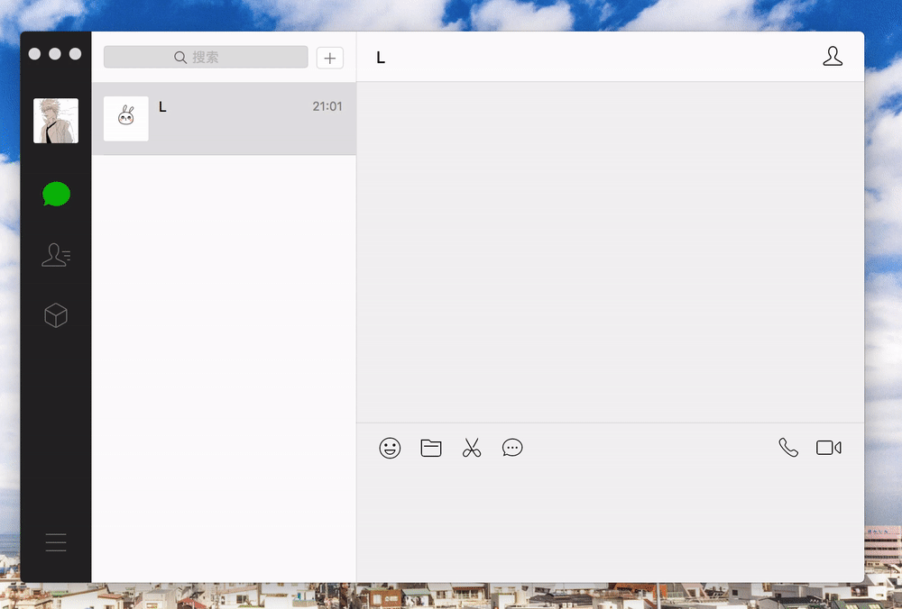
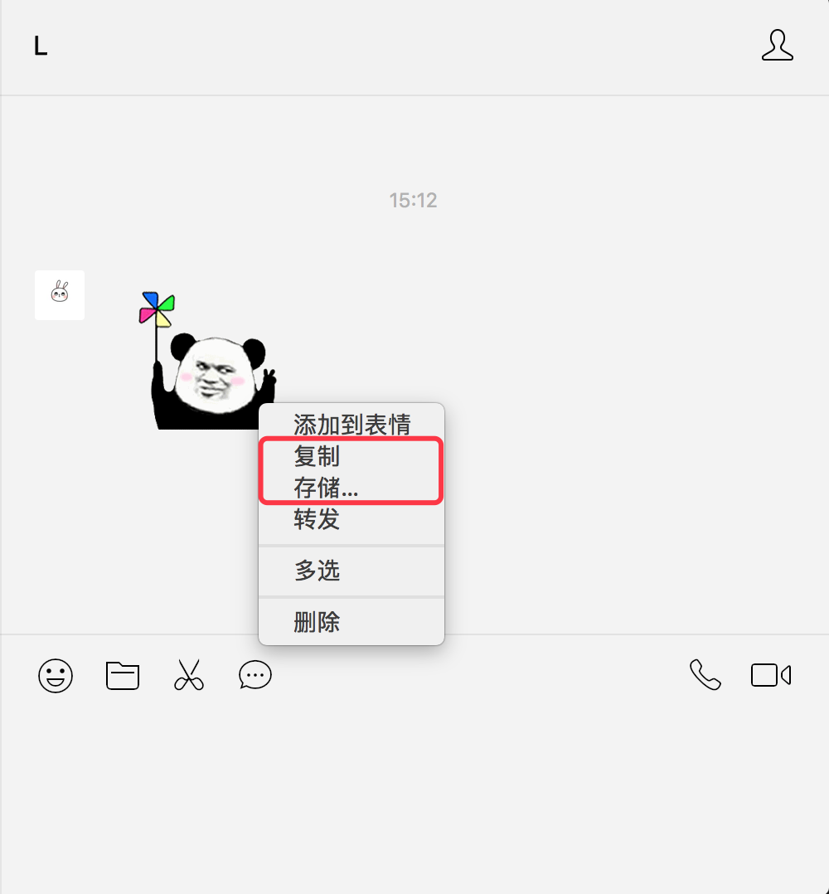
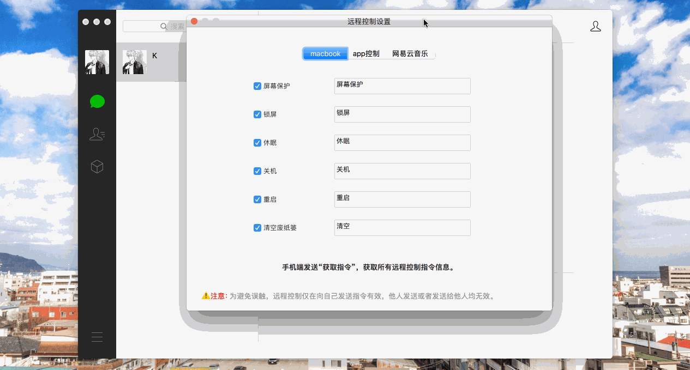
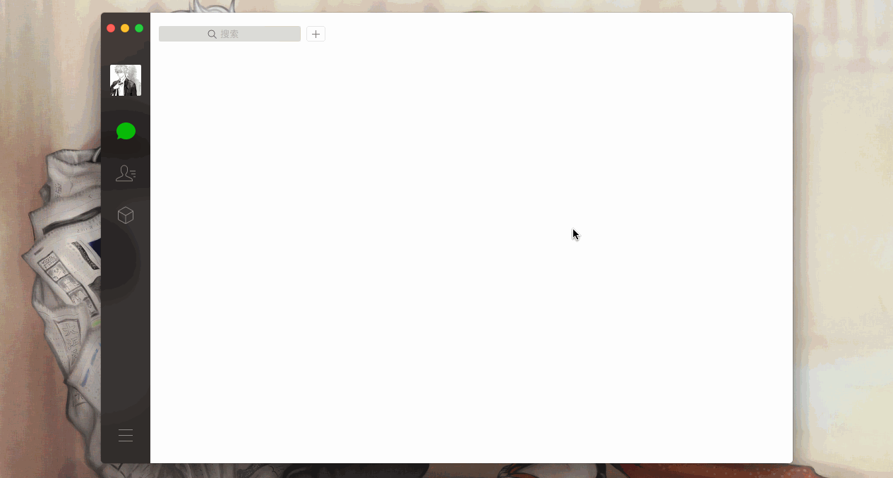
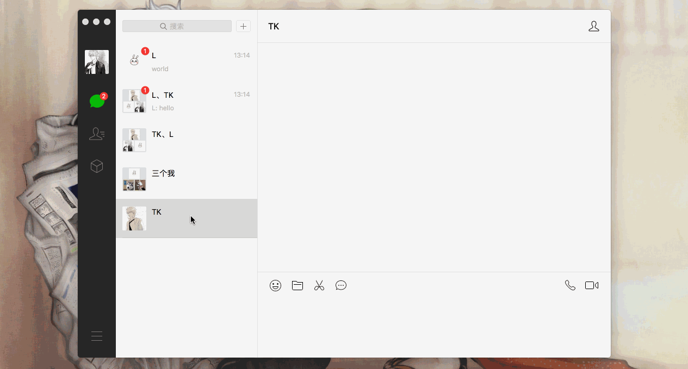
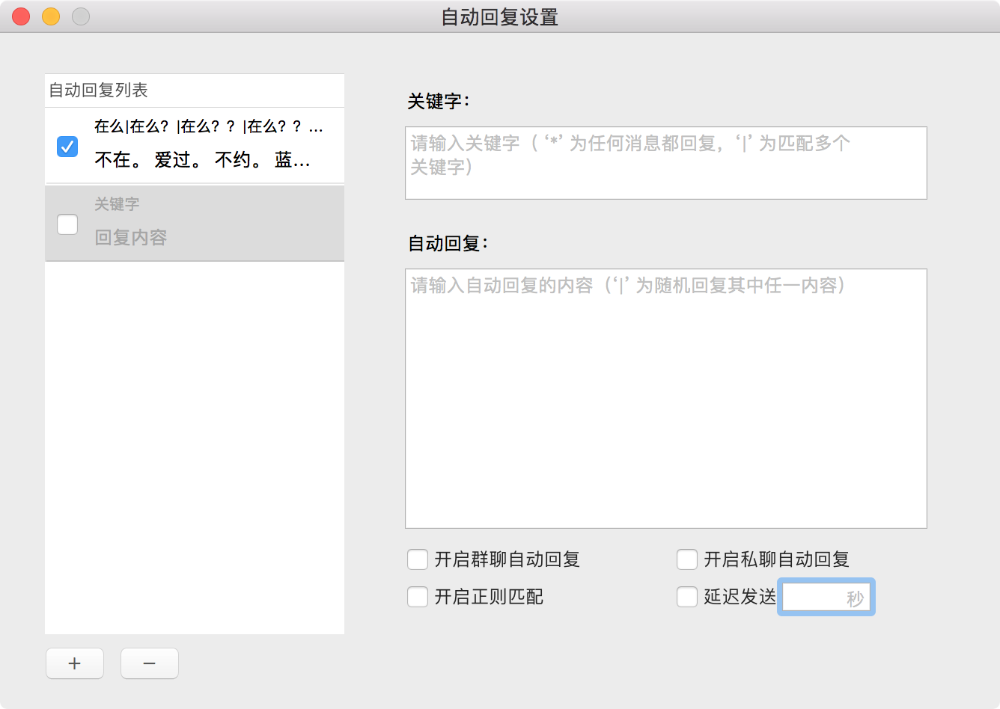
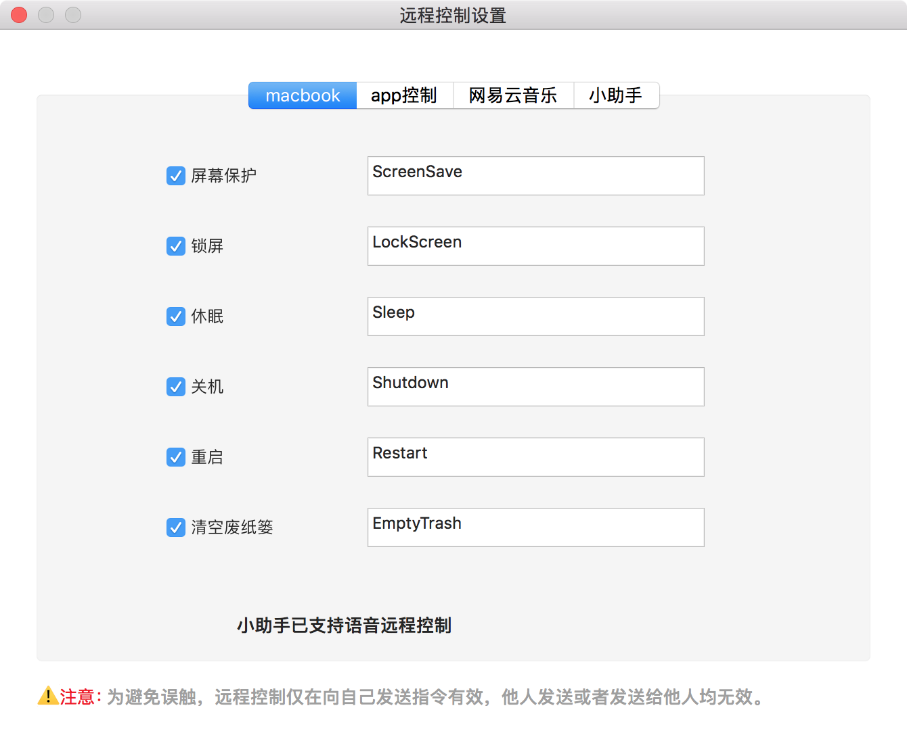

         

# 微信小助手 v1.7 

 **[English](./README_EN.md) | 中文**

[ [功能](#功能) &bull; [更新日志](#更新日志) &bull; [Demo演示](#demo演示) &bull; [使用](#使用) &bull; [安装](https://github.com/TKkk-iOSer/WeChatPlugin-MacOS/blob/master/Install.md) &bull; [卸载](#卸载) &bull; [TODO](#todo) ]

其他插件：  
[ [wechat-alfred-workflow](https://github.com/TKkk-iOSer/wechat-alfred-workflow) &bull; [QQ 版本](https://github.com/TKkk-iOSer/QQPlugin-macOS) &bull; [iOS 版本](https://github.com/TKkk-iOSer/WeChatPlugin-iOS) ]

---

## 功能
* 消息自动回复(支持特定回复 v1.7)
* 消息防撤回
* 远程控制(已支持语音)
* 微信多开
* 第二次登录免认证
* 聊天置底功能(~~类似置顶~~)
* 微信窗口置顶
* 会话多选删除
* 自动登录开关
* 通知中心快捷回复
* 聊天窗口表情包复制 & 存储
* 小助手检测更新提醒
* alfred 快捷发送消息 & 打开窗口 (需安装：[wechat-alfred-workflow](https://github.com/TKkk-iOSer/wechat-alfred-workflow))
* 会话一键已读(v1.7)
* 一键清除空会话(v1.7) 
* 支持国际化 (v1.7)
* 新增一键更新 (v1.7)
* 新增关于小助手 (v1.7)
* 去除微信url转链（从此直接打开抖音链接🌝

远程控制：

- [x] 屏幕保护
- [x] 清空废纸篓
- [x] 锁屏、休眠、关机、重启
- [x] 退出QQ、WeChat、Chrome、Safari、所有程序
- [x] 网易云音乐(播放、暂停、下一首、上一首、喜欢、取消喜欢)
- [x] 小助手(获取指令、防撤回开关、自动回复开关、免认证登录开关)

**若想使用远程控制网易云音乐，请在“系统偏好设置 ==> 安全性与隐私 ==> 隐私 ==> 辅助功能”中添加微信**

---

## 更新日志
* [新增好多功能…(2018-05-12)](https://github.com/TKkk-iOSer/WeChatPlugin-MacOS/releases/tag/v1.7)

* [新增自动回复延迟 & 修改置顶窗口快捷(2018-04-07)](https://github.com/TKkk-iOSer/WeChatPlugin-MacOS/releases/tag/v1.6.1)

* [新增 Alfred 快捷发送消息 & 打开聊天窗口(2018-03-18)](https://github.com/TKkk-iOSer/WeChatPlugin-MacOS/releases/tag/v1.6)

* [新增语音远程控制mac & 优化撤回消息、快捷回复(2018-03-03)](https://github.com/TKkk-iOSer/WeChatPlugin-MacOS/releases/tag/v1.5.1)

* [新增小助手检测更新&表情包复制存储等等 (2018-02-24)](https://github.com/TKkk-iOSer/WeChatPlugin-MacOS/releases/tag/v1.5.0)

* [新增窗口置顶&多选删除等等 (2017-10-11)](https://github.com/TKkk-iOSer/WeChatPlugin-MacOS/releases/tag/v1.4.0)

* [新增置底&免认证 (2017-09-17)](https://github.com/TKkk-iOSer/WeChatPlugin-MacOS/releases/tag/v1.3.0)

* [修复聊天记录消失的bug (2017-09-11)](https://github.com/TKkk-iOSer/WeChatPlugin-MacOS/releases/tag/v1.2.0)

* [重构自动回复，实现多回复 (2017-08-23)](https://github.com/TKkk-iOSer/WeChatPlugin-MacOS/releases/tag/v1.1.0)

**详细内容请查看**[CHANGELOG](https://github.com/TKkk-iOSer/WeChatPlugin-MacOS/blob/master/CHANGELOG.md)

---

## Demo演示

* 消息防撤回   

* 自动回复

* 微信多开

* 远程控制 (测试关闭Chrome、QQ、开启屏幕保护)

* 免认证 & 置底 & 多选删除

* 通知中心快捷回复   

* 聊天窗口表情复制 & 存储  

* 语音远程控制 mac   

* Alfred 快速搜索 [wechat-alfred-workflow](https://github.com/TKkk-iOSer/wechat-alfred-workflow)   

* 一键已读 & 一键清除空回话

---

## 使用

* 消息防撤回：点击`开启消息防撤回`或者快捷键`command + t`,即可开启、关闭。
* 自动回复：点击`开启自动回复`或者快捷键`conmand + k`，将弹出自动回复设置的窗口，点击红色箭头的按钮设置开关。    

>若关键字为 `*`，则任何信息都回复；  
>若关键字为`x|y`,则 x 和 y 都回复；   
>若关键字**或者**自动回复为空，则不开启该条自动回复；   
>可设置延迟回复，单位：秒；   
>若开启正则，请确认正则表达式书写正确，[在线正则表达式测试](http://tool.oschina.net/regex/)   
**若开启特定联系人回复，则原先的群聊&私聊回复无效**

* 微信多开：点击`登录新微信`或者快捷键`command + shift + n`,即可多开微信。

* 远程控制：点击`远程控制 Mac OS`或者快捷键`command + shift + c`,即可打开控制窗口。

**注意：仅向自己账号发送指令有效**

* Alfred 使用：请查看 [wechat-alfred-workflow](https://github.com/TKkk-iOSer/wechat-alfred-workflow)

---

## 安装

详细安装方法请查阅 [Install.md](https://github.com/TKkk-iOSer/WeChatPlugin-MacOS/blob/master/Install.md)

**0. 懒癌版安装(需要git支持)**

打开`应用程序-实用工具-Terminal(终端)`，执行以下命令并根据提示输入密码即可。

`cd ~/Downloads && rm -rf WeChatPlugin-MacOS && git clone https://github.com/TKkk-iOSer/WeChatPlugin-MacOS.git --depth=1 && ./WeChatPlugin-MacOS/Other/Install.sh`

**1. 普通安装**

* 点击`clone or download`按钮下载 WeChatPlugin 并解压，打开Terminal(终端)，拖动解压后`Install.sh` 文件(在 Other 文件夹中)到 Terminal 回车即可。

**2. 安装完成**

* 重启微信，在**菜单栏**中看到**微信小助手**即安装成功。 

--- 

## 卸载

打开Terminal(终端)，拖动解压后`Uninstall.sh` 文件(在 Other 文件夹中)到 Terminal 回车即可。

---

## TODO
- [x] 增加`Alfred`搜索
- [ ] 查看单向好友
- [ ] 语音(视频转发)
- [ ] 增加 brew 安装方式
- [x] 完善自动回复(指定好友回复)
- [x] 完善消息防撤回(显示撤回用户昵称)
- [x] ~~清除微信缓存(官方已加)~~
- [x] 优化小助手设置(更新后保留相关设置，更新提醒)
- [x] 语音远程控制 mac
- [x] 支持中英文

---

## 依赖

* [XMLReader](https://github.com/amarcadet/XMLReader)
* [insert_dylib](https://github.com/Tyilo/insert_dylib)
* [fishhook](https://github.com/facebook/fishhook)
* [GCDWebServer](https://github.com/swisspol/GCDWebServer)

---

### 听说你想请我喝下午茶？😏
 
&nbsp;&nbsp;&nbsp;

