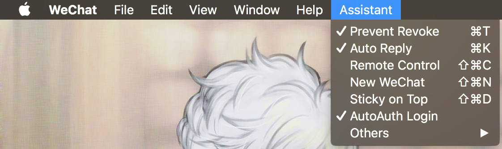
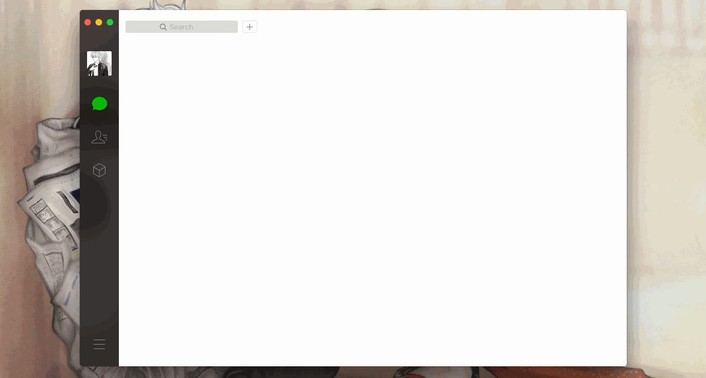
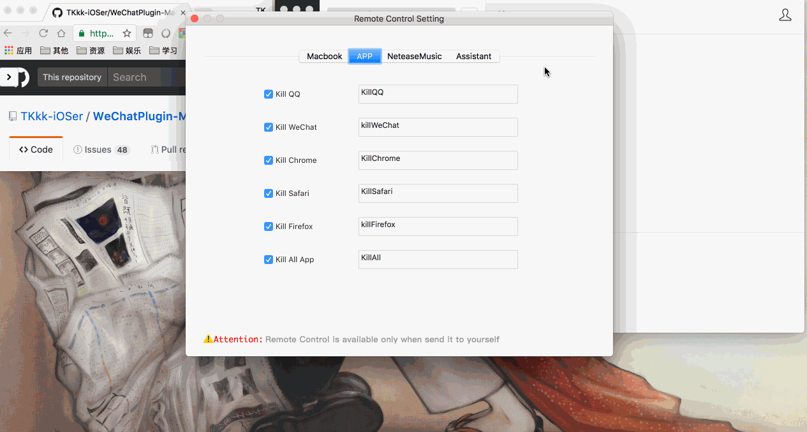
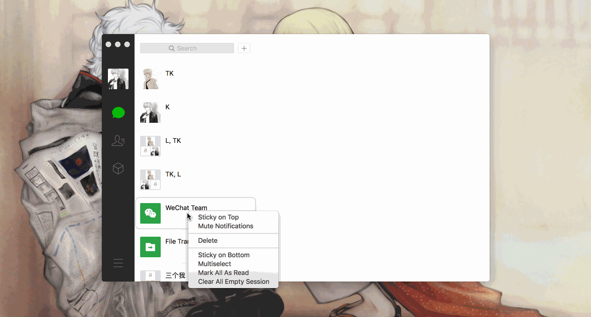
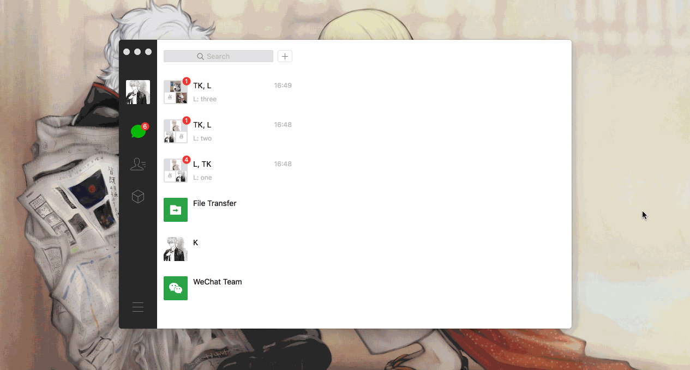
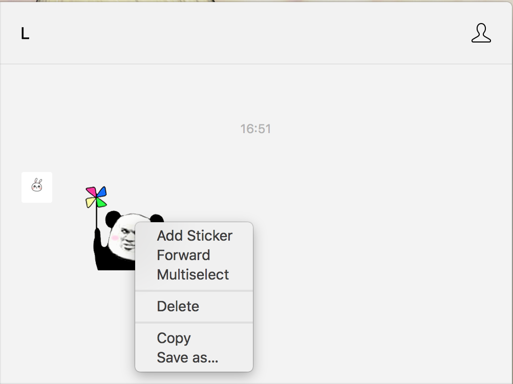
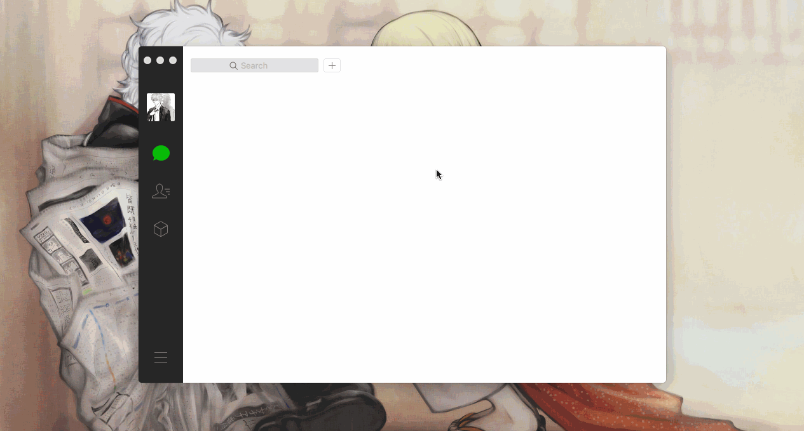

        

# WeChatPlugin-macOS v1.7

**English | [中文](./README.md)**

[ [Feature](#feature) &bull; [Install](#install) &bull; [Uninstall](#uninstall) &bull; [Usage](#usage)]

Other plugin：  
[ [wechat-alfred-workflow](https://github.com/TKkk-iOSer/wechat-alfred-workflow) &bull; [QQPlugin-macOS](https://github.com/TKkk-iOSer/QQPlugin-macOS) &bull; [WeChatPlugin-iOS](https://github.com/TKkk-iOSer/WeChatPlugin-iOS) ]

---

## Feature

* Message auto reply
* Prevent message recall
* Remote control(support voice control)
* Multiple WeChat
* Auto Auth Login
* Session Sticky Bottom
* Windows Sticky Top
* Session multiple delete
* Auto Login Switch
* Quick reply to notifications
* Copy or Export Sticker
* Update plugin
* Reply or Open session by Alfred  (dependency：[wechat-alfred-workflow](https://github.com/TKkk-iOSer/wechat-alfred-workflow))
* Make all session As Read
* Clear all empty session
* Remove url redirect

Remote Control：

- [x] Save Screen
- [x] Empty Trash
- [x] Lock Screen & Sleep  & Shut Down & Restart
- [x] Quit some app, include QQ、WeChat、Chrome、Safari。
- [x] NeteaseMusic(play、pause、next song、previous song、like song、unlike song)
- [x] Assistant(get all directive、prevent recall switch、auto reply switch、auto auth switch)

**If you want to control NeteaseMusic, please allow WeChat Control in "System Preferences-Security & Privacy-Privacy-Accessibility"**

---

## Install

**1. If you have installed Git**

open `/Applications/Utilities/Terminal.app`，run command

`cd ~/Downloads && rm -rf WeChatPlugin-MacOS && git clone https://github.com/TKkk-iOSer/WeChatPlugin-MacOS.git --depth=1 && ./WeChatPlugin-MacOS/Other/Install.sh`, and enter the mac password.

**2. Normal install**

* click `clone or download` button to download project and unzip it，open Terminal.app，Drag the `Install.sh` file(in `Other` Folder) to Terminal.

---

## Uninstall
open `/Applications/Utilities/Terminal.app`,Drag the `Uninstall.sh` file(in `Other` Folder) to Terminal.

---

## Usage

> A few examples of how to use WeChatPlugin-macOS.

* Prevent message recall   
  

* Message auto reply
  

* Auto Login & Multiple WeChat
  

* Remote control (quit Chrome and Save Screen)
  

* Session multiple delete & session sticky bottom &  delete empty session
  

* Quick reply to notifications &  make all as Read  
  

* Copy or export sticker  
  

* Reply or Open session by Alfred  [wechat-alfred-workflow](https://github.com/TKkk-iOSer/wechat-alfred-workflow)   
  

---

## Dependency

* [XMLReader](https://github.com/amarcadet/XMLReader)
* [insert_dylib](https://github.com/Tyilo/insert_dylib)
* [fishhook](https://github.com/facebook/fishhook)
* [GCDWebServer](https://github.com/swisspol/GCDWebServer)

---

### I hear somebody want to buy me a cup of coffee😏

&nbsp;&nbsp;&nbsp;

